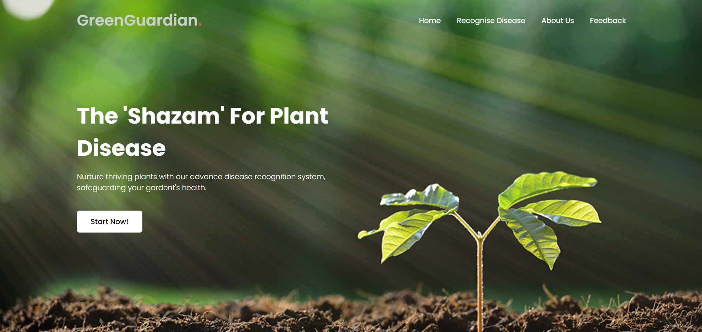

# GreenGuardian
Plant Disease Recognition System Using CNN

This project utilizes Convolutional Neural Network (CNNs) to identify plant diseases from leaf images and provides tailored treatment recommendations. Built with EfficientNetB0 for optimal accuracy, the system offers a user-friendly web interface for seamless interaction. If there are any inquiries, just contact me thru my email amirmstqm412@gmail.com. This project was built for my college's Final Year Project. Since I am still an amateur, so there might be any unnecessaries line of code in the project. I hope you can read and understand the README.txt file first before starting this project. Happy coding nerdies(JK) :p

    
